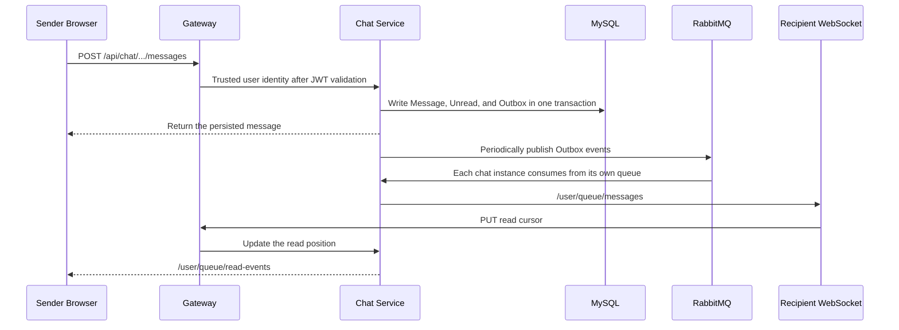

# Little Blue Note

Little Blue Note is an academic social platform designed for researchers, legal and medical professionals, and knowledge creators. The project uses Spring Cloud microservices, a Vue 3 single-page application, MySQL, Redis, RabbitMQ, and Nacos. It also provides content discovery and search ranking through a multi-layer hypergraph recommendation model.

This version includes a complete bidirectional friendship system and one-to-one real-time chat: conversations can be created and messages can be sent only after a friend request has been accepted. Friend relationships, messages, unread counts, reports, restrictions, and reliable delivery events are all persisted in the database.

## 1. Key Features

### 1.1 Users and Content

- User registration, standard user login, and a separate administrator login.
- Usernames may contain only ASCII letters, digits, and underscores; new user avatars automatically display the first two characters of the username.
- User profiles, avatars, biographies, educational backgrounds, and interest tags.
- Follow/unfollow support as a one-way relationship independent of friendship.
- Post publishing, likes, bookmarks, comments, and view-count statistics.
- Personalized recommendations in Discover, full-text search, and multi-layer hypergraph reranking.
- Administrator user lists, user search, and platform statistics.

### 1.2 Bidirectional Friendships

- Send friend requests by user ID or from a user profile, with an optional note of up to 200 characters.
- Manage incoming requests, outgoing requests, the friend list, and the blocklist separately.
- Accept, reject, or cancel requests; duplicate operations are handled idempotently.
- Friendships use a normalized user pair `(smaller user ID, larger user ID)`, and a unique database index ensures that only one relationship can exist between the same two users.
- Accepting a request and creating a private conversation are completed in the same database transaction.
- Removing a friend closes the conversation; blocking a user removes the friendship and prevents further interaction.
- Friendship events are written to an audit table and delivered to the other user through the real-time channel.

Friendship state transitions:

```text
NONE / REJECTED / CANCELLED / DELETED
                 │ Send request
                 ▼
              PENDING
        ┌────────┼────────┐
        │Accept  │Reject  │Cancel
        ▼        ▼        ▼
     ACCEPTED  REJECTED  CANCELLED
        │Remove / Block
        ▼
      DELETED
```

### 1.3 One-to-One Real-Time Chat

- Only users whose friendship status is `ACCEPTED` can start or continue a conversation.
- STOMP over WebSocket delivers messages, friendship events, read receipts, and typing indicators in real time.
- Reliable delivery pipeline: HTTP write + database Outbox + RabbitMQ + WebSocket.
- Each message includes a client-generated idempotency key, so network retries do not create duplicate database records.
- A 2,000-character limit, empty-message validation, per-minute message rate limiting, and friend-request rate limiting.
- Conversation list, latest message, unread counts, and cursor-based pagination for message history.
- Read receipts, message recall within two minutes, and inappropriate-message reporting.
- Online presence is maintained through Redis TTLs and heartbeats; Redis failures do not interrupt core chat functionality.
- The frontend reconnects automatically; real-time events missed while offline can be recovered from message history and unread counts.

Real-time message delivery flow:



### 1.4 Chat Moderation and Database Administration

- The administration dashboard reports active friendships, pending requests, active conversations, messages sent today, open reports, active restrictions, and delivery backlog.
- Administrators can review and resolve message reports.
- Administrators can apply `CHAT_BAN` or `FRIEND_BAN` restrictions with an expiration time or as permanent restrictions.
- Expired restrictions are automatically deactivated by scheduled tasks.
- The administration dashboard shows database Outbox status, failure reasons, and retry counts, and allows failed events to be retried manually.
- Successfully published Outbox records are retained for seven days by default and then removed to prevent unbounded table growth.
- Flyway manages incremental migrations; the complete initialization scripts remain available in `backend/sql`.
- Foreign keys, unique indexes, check constraints, and transactions preserve consistency across relationships, conversations, and messages.

## 2. Technical Architecture

| Technology | Purpose |
|---|---|
| Spring Boot / Spring MVC | REST services for users, posts, recommendations, and chat |
| Spring Cloud Gateway | Unified entry point, JWT validation, and HTTP/WebSocket routing |
| Nacos | Service discovery and optional configuration center |
| OpenFeign | Batch user-profile queries between microservices |
| MyBatis Plus | Persistence for relationships, conversations, messages, and existing business data |
| Flyway | Incremental chat database migrations |
| MySQL 8 | Primary application database: `little_blue_note` |
| Redis | Recommendation cache, rate limiting, presence, and real-time event deduplication |
| RabbitMQ | Post events, cross-layer events, and chat Outbox events |
| STOMP / WebSocket | User-specific real-time message queues |
| Vue 3 / Pinia / Vue Router | Frontend pages and friendship/chat state management |
| `@stomp/stompjs` | Browser STOMP client, heartbeats, and automatic reconnection |
| Node.js layer-sync | Real-time committee-layer synchronization and cross-network updates |

Service ports:

| Port | Service |
|---:|---|
| 5173 | Vue frontend |
| 8080 | Spring Cloud Gateway |
| 8081 | User Service |
| 8082 | Post Service |
| 8083 | Recommend Service |
| 8084 | Chat Service |
| 9099 | Node layer-sync |
| 8848 / 9848 | Nacos HTTP / gRPC |
| 3307 | MySQL (Docker-mapped port; 3306 inside the container) |
| 6379 | Redis |
| 5672 / 15672 | RabbitMQ / Management Console |

## 3. Project Directory Structure

```text
bluenote-main/
├─ .github/workflows/ci.yml           GitHub Actions backend tests and frontend build
├─ backend/                            Java backend Maven multi-module project
│  ├─ lbn-common/                      Shared Result, UserDTO, JWT, request headers, and MQ constants
│  ├─ lbn-gateway/                     JWT authentication, trusted identity-header injection, HTTP/WS routing
│  ├─ lbn-user-service/                Registration, login, profiles, follows, and user/admin APIs
│  ├─ lbn-post-service/                Posts, comments, likes, bookmarks, and post events
│  ├─ lbn-recommend-service/           Recommendations, search, Redis cache, and hypergraph model loading
│  ├─ lbn-chat-service/                Friends, conversations, messages, WebSocket, Outbox, and moderation
│  └─ sql/                             Full schema.sql and demonstration seed.sql
├─ frontend/                           Vue 3 + Vite frontend
│  ├─ src/api/                         Axios instance, JWT request interception, and 401 handling
│  ├─ src/components/                  Reusable components such as post components
│  ├─ src/realtime/                    STOMP WebSocket connection, subscriptions, reconnection, and typing events
│  ├─ src/router/                      Page routes and user/admin authorization guards
│  ├─ src/store/                       Pinia stores for auth, friends, and chat
│  ├─ src/styles/                      Global theme and base component styles
│  └─ src/views/                       Login, Discover, search, friends, messages, profile, and admin pages
├─ layer-sync-service/                 Node.js committee-layer synchronization service
├─ data/
│  ├─ raw/                             Raw Senate bills / committees data
│  └─ generated/                       Generated users, posts, recommendation models, and committee events
├─ infra/
│  ├─ docker-compose.yml               Reproducible MySQL, Redis, RabbitMQ, and Nacos orchestration
│  └─ nacos/                           Local Nacos distribution for use without Docker
├─ scripts/
│  ├─ setup_env.sh                     First-time macOS environment setup
│  ├─ start_all.sh / stop_all.sh       macOS startup and shutdown scripts
│  ├─ start_all.ps1 / stop_all.ps1     One-command Windows startup and shutdown scripts
│  ├─ status_all.ps1                   Windows service status check
│  ├─ push_to_github.ps1/.sh           Safely create or connect to a remote repository and push
│  ├─ realtime_chat_smoke.mjs          Two-user HTTP + STOMP end-to-end real-time smoke test
│  ├─ chat_acceptance.mjs              Complete friendship, chat, moderation, and authorization acceptance test
│  ├─ prepare_data.py                  Data preparation and recommendation-signal precomputation
│  ├─ gen_sql.py                       Generate demonstration-data SQL
│  └─ fetch_avatars.py                 Fill in missing avatars
├─ .env.example                        Infrastructure and service environment-variable template
├─ .gitattributes                      Cross-platform line-ending and binary-file rules
├─ .gitignore                          Excludes dependencies, build artifacts, logs, and local secrets
└─ README.md                           This document
```

### Internal Structure of `lbn-chat-service`

| Directory | Purpose |
|---|---|
| `config` | MyBatis, Redis, RabbitMQ, WebSocket, and heartbeat configuration |
| `controller` | Friend, chat, and administrator REST APIs |
| `dto` | Validated request objects |
| `entity` | Friendship, conversation, message, report, restriction, and Outbox entities |
| `exception` | Unified business exceptions and HTTP error responses |
| `mapper` | MyBatis Plus mappers, row locks, and atomic-update SQL |
| `mq` | Outbox publishing and RabbitMQ real-time event consumption |
| `service` | Friendship state machine, chat rules, moderation, rate limiting, and maintenance tasks |
| `util` | Normalized friendship user pairs and message-input policies |
| `websocket` | User principals, presence, and typing-status controller |
| `resources/db/migration` | Flyway V2 friendship/chat tables and V3 user-ID concurrency hardening |
| `src/test` | Friendship boundary, message validation, and real-time delivery deduplication tests |

## 4. Chat Database Tables

| Table | Purpose and Key Constraints |
|---|---|
| `lbn_friend_relation` | Bidirectional friendship; unique normalized user pair; includes status and optimistic-lock version |
| `lbn_friend_event` | Audit log for requests, acceptance, rejection, removal, and blocking |
| `lbn_user_block` | One-way blocklist; unique blocker-blocked-user pair |
| `lbn_conversation` | One unique private conversation per friendship |
| `lbn_conversation_member` | Two members, unread count, read cursor, and pinned/muted state |
| `lbn_message` | Text message, client idempotency key, reply target, and recall status |
| `lbn_chat_outbox` | Reliable events written within business transactions, including publish status, retries, and errors |
| `lbn_user_chat_restriction` | Administrator restrictions on chat/friend functionality and their validity periods |
| `lbn_chat_report` | User message reports, handler, outcome, and resolution time |

Do not rerun `schema.sql` in an environment that already contains data, because it is a full rebuild script. Existing databases should be upgraded through the incremental Flyway migrations executed when Chat Service starts.

## 5. Key APIs

### Friend APIs

| Method | Path | Description |
|---|---|---|
| POST | `/api/friends/requests` | Send a friend request |
| GET | `/api/friends/requests/incoming` | List incoming requests |
| GET | `/api/friends/requests/outgoing` | List outgoing requests |
| POST | `/api/friends/requests/{id}/accept` | Accept a request and create a conversation |
| POST | `/api/friends/requests/{id}/reject` | Reject a request |
| POST | `/api/friends/requests/{id}/cancel` | Cancel a request |
| GET | `/api/friends` | List friends |
| GET | `/api/friends/{userId}/status` | Get the relationship status with a specific user |
| DELETE | `/api/friends/{userId}` | Remove a friend and close the conversation |
| POST/DELETE | `/api/friends/{userId}/block` | Block/unblock a user |

### Chat APIs

| Method | Path | Description |
|---|---|---|
| POST | `/api/chat/conversations/private/{friendId}` | Start or retrieve a private conversation with a friend |
| GET | `/api/chat/conversations` | List conversations and unread counts |
| GET | `/api/chat/conversations/{id}/messages` | Retrieve message history using the `beforeId` cursor |
| POST | `/api/chat/conversations/{id}/messages` | Send an idempotent message |
| PUT | `/api/chat/conversations/{id}/read` | Update the read cursor |
| POST | `/api/chat/messages/{id}/recall` | Recall a message within two minutes |
| POST | `/api/chat/messages/{id}/report` | Report a message |
| GET | `/api/chat/presence?ids=1,2` | Query presence for multiple users |

The WebSocket endpoint is `/ws/chat`. The client sends `Authorization: Bearer <JWT>` in the STOMP `CONNECT` frame. A user may subscribe only to their own `/user/queue/*` destinations and may send typing-status events only to `/app/chat/typing`.

## 6. Environment Configuration

Copy `.env.example` and replace all default passwords and JWT secrets in shared or production environments. The Java services support the following environment variables:

- `LBN_DB_URL`, `LBN_DB_USER`, `LBN_DB_PASSWORD`
- `LBN_REDIS_HOST`, `LBN_REDIS_PORT`
- `LBN_RABBIT_HOST`, `LBN_RABBIT_PORT`, `LBN_RABBIT_USER`, `LBN_RABBIT_PASSWORD`
- `LBN_NACOS_ADDR`
- `LBN_JWT_SECRET` (required; at least 32 UTF-8 bytes; the value must be identical across all services that issue or validate JWTs)
- `LBN_WS_ALLOWED_ORIGINS` (comma-separated WebSocket origin patterns)

## 7. Running the Project

### One-Command Windows Startup (Recommended)

Ensure that Docker Desktop, JDK 17+, Maven, and Node.js are installed, and prepare the `.env` file. Run the following command from the project root:

```powershell
powershell.exe -ExecutionPolicy Bypass -File .\scripts\start_all.ps1
```

The script automatically starts Docker Desktop if it is not already running, followed by MySQL, Redis, RabbitMQ, Nacos, the five Java services, layer-sync, and the Vue frontend. It then verifies the login API. Repeated execution does not restart services whose ports are already in use.

Check the status of all services:

```powershell
powershell.exe -ExecutionPolicy Bypass -File .\scripts\status_all.ps1
```

Stop application processes while keeping infrastructure services such as the database running:

```powershell
powershell.exe -ExecutionPolicy Bypass -File .\scripts\stop_all.ps1
```

Stop the Docker infrastructure as well while preserving data volumes:

```powershell
powershell.exe -ExecutionPolicy Bypass -File .\scripts\stop_all.ps1 -StopInfrastructure
```

### Option A: Start Infrastructure with Docker

Docker Desktop / Docker Engine, JDK 17+, Maven, and Node.js are required.

```powershell
Copy-Item .env.example .env
docker compose --env-file .env -f infra/docker-compose.yml up -d
```

Load the same variables from `.env` into the terminal used to start the Java services, then build the project:

```powershell
cd backend
mvn clean package
cd ../frontend
npm install
npm run dev
```

Each backend module can be started by running its corresponding `target/*.jar` file. First verify that Nacos, MySQL, Redis, and RabbitMQ are healthy, then start the services on ports 8081–8084 and finally the gateway on port 8080.

The Docker MySQL initialization scripts run only when the data volume is created for the first time. Do not remove the `lbn_mysql_data` volume when existing data must be preserved.

### Option B: Use Existing Local Infrastructure

When local MySQL, Redis, RabbitMQ, and Nacos instances use their default ports, configure the appropriate credentials and build and start the project directly. On macOS, you may also continue to use:

```bash
bash scripts/setup_env.sh
bash scripts/start_all.sh
```

Demonstration accounts:

| Role | Username | Password |
|---|---|---|
| Standard User A | `mcclellan` | `lbn123456` |
| Standard User B | `ervin` | `lbn123456` |
| Administrator | `admin` | `admin123` |

Plaintext demonstration passwords in the seed data are automatically migrated to BCrypt after the first successful login. Newly registered accounts are always stored using BCrypt.

## 8. Testing and Acceptance

### Backend Automated Tests

```powershell
cd backend
mvn test
```

Test coverage includes:

- Bidirectional normalization of friendship user pairs, self-friend rejection, and invalid-member rejection.
- Client message idempotency keys, empty text, length limits, and Unicode boundaries.
- RabbitMQ event delivery to a specified user's private queue.
- Suppression of repeated delivery for the same Outbox event.
- JWT-authenticated STOMP `CONNECT`, private-queue subscription, and message-frame round trips on a random real port.

### Frontend Production Build

```powershell
cd frontend
npm run build
```

### Two-User Real-Time End-to-End Smoke Test

Start all infrastructure, backend services, and the gateway first, then run:

```powershell
node scripts/realtime_chat_smoke.mjs
```

The script automatically performs the following flow: log in two users → establish or reuse a friendship → establish STOMP connections for both users → User A persists and sends a message → User B receives the same message in real time → User B updates the read cursor → User A receives the read receipt in real time. Successful output resembles:

```text
PASS conversation=1 message=1 sender=1 recipient=2
```

Use `LBN_SMOKE_HTTP`, `LBN_SMOKE_WS`, `LBN_SMOKE_USER_A/B`, and `LBN_SMOKE_PASSWORD_A/B` to override test endpoints and account credentials.

### Complete Friendship and Chat Acceptance Test

```powershell
node scripts/chat_acceptance.mjs
```

This script uses three standard user accounts and one administrator account to verify that non-friends cannot chat, friendships can be re-established, messages are delivered in real time, unread counts are correct, operations are idempotent, unauthorized access is prevented, read receipts work, messages can be recalled, reports can be resolved, chat bans can be applied and removed, and database Outbox events can be managed. A successful test prints `PASS checks=33 ...`.

## 9. Security and Consistency Highlights

- The gateway first removes any client-provided `X-User-Id` and `X-User-Role` headers, then writes the identity parsed from the JWT to prevent identity-header spoofing.
- The WebSocket handshake does not trust query parameters; identity is validated again in the STOMP `CONNECT` frame.
- Users cannot subscribe to another user's queue or bypass REST business validation by sending messages through WebSocket.
- Friend-request acceptance, conversation creation, message writes, unread-count updates, and Outbox writes use database transactions.
- Unique relationship indexes, unique message idempotency indexes, and row locks handle duplicate submissions and concurrent operations.
- Message content is rendered as text in Vue to prevent direct HTML injection.
- Redis rate limiting uses a fail-open strategy: cache failures do not cause core data loss, and database rules remain effective.
- RabbitMQ delivery uses Publisher Confirms, dead-letter queues, exponential backoff, and database retry records.
- Each Chat Service instance declares its own auto-delete queue so that every local STOMP broker receives events during horizontal scaling; Redis deduplication keys include the instance ID.

## License

Academic / demonstration project. The Senate data comes from a publicly available congressional hypergraph dataset.
