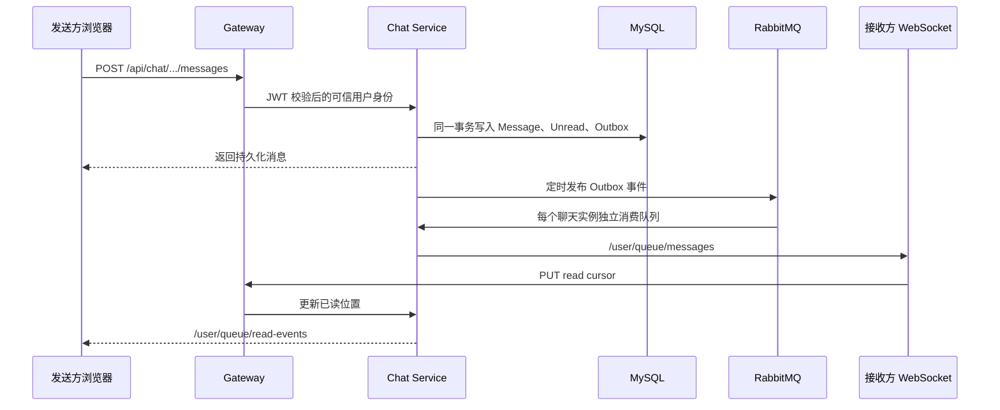

# Little Blue Note（小蓝书）

Little Blue Note 是一个面向科研、法律、医学和知识创作者的学术社交平台。项目采用 Spring Cloud 微服务、Vue 3 单页应用、MySQL、Redis、RabbitMQ 和 Nacos，并通过多层超图推荐模型提供内容发现与搜索排序。

本版本已加入完整的双向好友与一对一实时聊天系统：只有好友申请被接受后才能创建会话和发送消息；好友关系、消息、未读数、举报、封禁和可靠投递事件均持久化到数据库。

## 一、主要功能

### 1. 用户与内容

- 用户注册、普通用户登录、管理员独立登录。
- 注册用户名仅允许 ASCII 字母、数字和下划线；新用户头像自动显示用户名前两个字符。
- 个人资料、头像、简介、教育背景和兴趣标签。
- 关注/取消关注（单向关系，与好友关系相互独立）。
- 发布帖子、点赞、收藏、评论、浏览量统计。
- Discover 个性化推荐、全文搜索和多层超图重排。
- 管理员用户列表、用户检索和平台统计。

### 2. 双向好友

- 根据用户 ID 或个人主页发送好友申请，可附带 200 字以内备注。
- 收到的申请、发出的申请、好友列表、黑名单分开管理。
- 接受、拒绝、撤销申请；重复请求采用幂等处理。
- 好友关系使用规范化用户对 `(较小用户 ID, 较大用户 ID)`，数据库唯一索引保证双方只能存在一条关系。
- 接受申请与创建私聊会话在同一个数据库事务中完成。
- 删除好友会关闭会话；拉黑会解除好友关系并禁止继续互动。
- 好友事件写入审计表，并通过实时通道通知对方。

好友状态流转：

```text
NONE / REJECTED / CANCELLED / DELETED
                 │ 发送申请
                 ▼
              PENDING
        ┌────────┼────────┐
        │接受    │拒绝    │撤销
        ▼        ▼        ▼
     ACCEPTED  REJECTED  CANCELLED
        │删除/拉黑
        ▼
      DELETED
```

### 3. 一对一实时聊天

- 只有状态为 `ACCEPTED` 的好友可以开启或继续会话。
- STOMP over WebSocket 实时接收消息、好友事件、已读回执和正在输入状态。
- HTTP 写入 + 数据库 Outbox + RabbitMQ + WebSocket 的可靠投递链路。
- 每条消息包含客户端幂等号，网络重试不会重复入库。
- 2000 字限制、空消息校验、每分钟发送限流、好友申请限流。
- 会话列表、最近消息、未读数、历史消息游标分页。
- 消息已读回执、两分钟内撤回、举报不当消息。
- 在线状态使用 Redis TTL 和心跳维护；Redis 故障不会阻断核心聊天。
- 前端自动重连；离线期间未收到的实时事件可从消息历史和未读数恢复。

实时消息链路：



### 4. 聊天治理与数据库管理

- 管理后台统计活跃好友数、待处理申请、活跃会话、今日消息、开放举报、限制数和投递积压。
- 管理员查看并处理消息举报。
- 管理员可对用户添加 `CHAT_BAN` 或 `FRIEND_BAN`，支持截止时间和永久限制。
- 限制到期后定时自动失效。
- 管理后台查看数据库 Outbox 状态、失败原因和重试次数，并可手动重试失败事件。
- 已成功发布的 Outbox 默认保留 7 天后清理，避免业务表无限增长。
- Flyway 管理增量迁移；完整初始化脚本仍保留在 `backend/sql`。
- 外键、唯一索引、检查约束和事务保证关系、会话与消息的一致性。

## 二、技术架构

| 技术 | 作用 |
|---|---|
| Spring Boot / Spring MVC | 用户、帖子、推荐、聊天 REST 服务 |
| Spring Cloud Gateway | 统一入口、JWT 校验、HTTP/WebSocket 路由 |
| Nacos | 服务发现和可选配置中心 |
| OpenFeign | 微服务间用户资料批量查询 |
| MyBatis Plus | 关系、会话、消息及现有业务数据持久化 |
| Flyway | 聊天数据库增量迁移 |
| MySQL 8 | 主业务数据库 `little_blue_note` |
| Redis | 推荐缓存、限流、在线状态、实时事件去重 |
| RabbitMQ | 帖子事件、跨层事件、聊天 Outbox 事件 |
| STOMP / WebSocket | 用户专属实时消息队列 |
| Vue 3 / Pinia / Vue Router | 前端页面、好友状态和聊天状态管理 |
| `@stomp/stompjs` | 浏览器 STOMP 客户端、心跳和自动重连 |
| Node.js layer-sync | 委员会层实时同步与跨网络更新 |

服务端口：

| 端口 | 服务 |
|---:|---|
| 5173 | Vue 前端 |
| 8080 | Spring Cloud Gateway |
| 8081 | User Service |
| 8082 | Post Service |
| 8083 | Recommend Service |
| 8084 | Chat Service |
| 9099 | Node layer-sync |
| 8848 / 9848 | Nacos HTTP / gRPC |
| 3307 | MySQL（Docker 映射端口；容器内为 3306） |
| 6379 | Redis |
| 5672 / 15672 | RabbitMQ / 管理控制台 |

## 三、项目文件夹作用

```text
bluenote-main/
├─ .github/workflows/ci.yml           GitHub Actions 后端测试与前端构建
├─ backend/                         Java 后端 Maven 多模块工程
│  ├─ lbn-common/                  公共 Result、UserDTO、JWT、请求头和 MQ 常量
│  ├─ lbn-gateway/                 JWT 认证、可信身份头注入、HTTP/WS 路由
│  ├─ lbn-user-service/            登录注册、资料、关注、用户和管理员接口
│  ├─ lbn-post-service/            帖子、评论、点赞、收藏和帖子事件
│  ├─ lbn-recommend-service/       推荐、搜索、Redis 缓存和超图模型读取
│  ├─ lbn-chat-service/            好友、会话、消息、WebSocket、Outbox、治理
│  └─ sql/                         全量 schema.sql 与演示 seed.sql
├─ frontend/                       Vue 3 + Vite 前端
│  ├─ src/api/                     Axios 实例、JWT 请求拦截和 401 处理
│  ├─ src/components/              帖子等复用组件
│  ├─ src/realtime/                STOMP WebSocket 连接、订阅、重连、输入事件
│  ├─ src/router/                  页面路由和用户/管理员权限守卫
│  ├─ src/store/                   auth、friend、chat 三类 Pinia 状态
│  ├─ src/styles/                  全局主题和基础组件样式
│  └─ src/views/                   登录、发现、搜索、好友、消息、资料和后台页面
├─ layer-sync-service/             Node.js 委员会层同步服务
├─ data/
│  ├─ raw/                         原始 Senate bills / committees 数据
│  └─ generated/                   用户、帖子、推荐模型和委员会事件数据
├─ infra/
│  ├─ docker-compose.yml           MySQL、Redis、RabbitMQ、Nacos 可复现编排
│  └─ nacos/                       本地 Nacos 发行文件（无 Docker 时可用）
├─ scripts/
│  ├─ setup_env.sh                 macOS 首次环境安装
│  ├─ start_all.sh / stop_all.sh   macOS 启停脚本
│  ├─ start_all.ps1 / stop_all.ps1 Windows 一键启停脚本
│  ├─ status_all.ps1               Windows 服务状态检查
│  ├─ push_to_github.ps1/.sh       安全创建或连接远程仓库并推送
│  ├─ realtime_chat_smoke.mjs      双用户 HTTP + STOMP 端到端实时冒烟测试
│  ├─ chat_acceptance.mjs           好友、聊天、治理和权限完整验收脚本
│  ├─ prepare_data.py              数据准备与推荐信号预计算
│  ├─ gen_sql.py                   生成演示数据 SQL
│  └─ fetch_avatars.py             头像补全
├─ .env.example                    基础设施和服务环境变量模板
├─ .gitattributes                  跨平台换行与二进制文件规则
├─ .gitignore                      排除依赖、构建产物、日志和本地密钥
└─ README.md                       本文档
```

### `lbn-chat-service` 内部结构

| 目录 | 作用 |
|---|---|
| `config` | MyBatis、Redis、RabbitMQ、WebSocket 和心跳配置 |
| `controller` | 好友、聊天和管理员 REST 接口 |
| `dto` | 参数校验后的请求对象 |
| `entity` | 好友、会话、消息、举报、限制和 Outbox 实体 |
| `exception` | 统一业务异常及 HTTP 错误返回 |
| `mapper` | MyBatis Plus Mapper、行锁和原子更新 SQL |
| `mq` | Outbox 发布和 RabbitMQ 实时事件消费 |
| `service` | 好友状态机、聊天规则、治理、限流、维护任务 |
| `util` | 好友规范化用户对和消息输入策略 |
| `websocket` | 用户 Principal、在线状态、输入状态控制器 |
| `resources/db/migration` | Flyway V2 好友聊天表、V3 用户 ID 并发加固 |
| `src/test` | 好友边界、消息校验和实时投递去重测试 |

## 四、聊天数据库表

| 表名 | 作用与关键约束 |
|---|---|
| `lbn_friend_relation` | 双向好友关系；规范化用户对唯一；带状态和乐观锁版本 |
| `lbn_friend_event` | 申请、接受、拒绝、删除、拉黑审计日志 |
| `lbn_user_block` | 单向黑名单；拉黑人与被拉黑人唯一 |
| `lbn_conversation` | 一段好友关系对应唯一私聊会话 |
| `lbn_conversation_member` | 两名成员、未读数、已读游标、置顶/静音状态 |
| `lbn_message` | 文本消息、客户端幂等号、回复目标、撤回状态 |
| `lbn_chat_outbox` | 业务事务内可靠事件，记录发布状态、重试和错误 |
| `lbn_user_chat_restriction` | 管理员聊天/好友功能限制及有效期 |
| `lbn_chat_report` | 用户消息举报、处理人、结果和处理时间 |

不要在已经存在数据的环境中重新执行 `schema.sql`，因为它是全量重建脚本。已有数据库应由 Chat Service 启动时运行 Flyway 增量迁移。

## 五、关键接口

### 好友接口

| 方法 | 路径 | 说明 |
|---|---|---|
| POST | `/api/friends/requests` | 发送好友申请 |
| GET | `/api/friends/requests/incoming` | 收到的申请 |
| GET | `/api/friends/requests/outgoing` | 发出的申请 |
| POST | `/api/friends/requests/{id}/accept` | 接受并创建会话 |
| POST | `/api/friends/requests/{id}/reject` | 拒绝申请 |
| POST | `/api/friends/requests/{id}/cancel` | 撤销申请 |
| GET | `/api/friends` | 好友列表 |
| GET | `/api/friends/{userId}/status` | 与指定用户的关系状态 |
| DELETE | `/api/friends/{userId}` | 删除好友并关闭会话 |
| POST/DELETE | `/api/friends/{userId}/block` | 拉黑/解除拉黑 |

### 聊天接口

| 方法 | 路径 | 说明 |
|---|---|---|
| POST | `/api/chat/conversations/private/{friendId}` | 开启或获取好友会话 |
| GET | `/api/chat/conversations` | 会话列表和未读数 |
| GET | `/api/chat/conversations/{id}/messages` | `beforeId` 游标历史消息 |
| POST | `/api/chat/conversations/{id}/messages` | 发送幂等消息 |
| PUT | `/api/chat/conversations/{id}/read` | 更新已读游标 |
| POST | `/api/chat/messages/{id}/recall` | 两分钟内撤回 |
| POST | `/api/chat/messages/{id}/report` | 举报消息 |
| GET | `/api/chat/presence?ids=1,2` | 批量查询在线状态 |

WebSocket 端点为 `/ws/chat`。客户端在 STOMP `CONNECT` 帧传入 `Authorization: Bearer <JWT>`，仅允许订阅自己的 `/user/queue/*`，仅允许向 `/app/chat/typing` 发送输入状态。

## 六、环境配置

复制 `.env.example` 并在共享或生产环境替换所有默认密码与 JWT 密钥。Java 服务支持以下环境变量：

- `LBN_DB_URL`、`LBN_DB_USER`、`LBN_DB_PASSWORD`
- `LBN_REDIS_HOST`、`LBN_REDIS_PORT`
- `LBN_RABBIT_HOST`、`LBN_RABBIT_PORT`、`LBN_RABBIT_USER`、`LBN_RABBIT_PASSWORD`
- `LBN_NACOS_ADDR`
- `LBN_JWT_SECRET`（必填，至少 32 个 UTF-8 字节；所有签发和校验 JWT 的服务必须完全一致）
- `LBN_WS_ALLOWED_ORIGINS`（逗号分隔的 WebSocket Origin pattern）

## 七、启动方式

### Windows 一键启动（推荐）

确保 Docker Desktop、JDK 17+、Maven、Node.js 已安装，并已准备 `.env`。在项目根目录执行：

```powershell
powershell.exe -ExecutionPolicy Bypass -File .\scripts\start_all.ps1
```

该脚本会自动启动 Docker Desktop（如尚未运行）、MySQL、Redis、RabbitMQ、Nacos、五个 Java 服务、layer-sync 和 Vue 前端，并在最后验证登录接口。重复执行不会重复启动已经占用端口的服务。

检查全部服务状态：

```powershell
powershell.exe -ExecutionPolicy Bypass -File .\scripts\status_all.ps1
```

停止应用进程但保留数据库等基础设施：

```powershell
powershell.exe -ExecutionPolicy Bypass -File .\scripts\stop_all.ps1
```

同时停止 Docker 基础设施（保留数据卷）：

```powershell
powershell.exe -ExecutionPolicy Bypass -File .\scripts\stop_all.ps1 -StopInfrastructure
```

### 方式 A：Docker 启动基础设施

需要 Docker Desktop / Docker Engine 与 JDK 17+、Maven、Node.js。

```powershell
Copy-Item .env.example .env
docker compose --env-file .env -f infra/docker-compose.yml up -d
```

将 `.env` 中相同的变量加载到启动 Java 服务的终端，然后构建：

```powershell
cd backend
mvn clean package
cd ../frontend
npm install
npm run dev
```

后端服务可分别执行各模块 `target/*.jar`。先确认 Nacos、MySQL、Redis、RabbitMQ 健康，再启动 8081–8084 服务和 8080 网关。

Docker 的 MySQL 初始化脚本只会在数据卷第一次创建时执行。需要保留数据时不要删除 `lbn_mysql_data` 卷。

### 方式 B：已有本地基础设施

本地 MySQL、Redis、RabbitMQ 和 Nacos 使用默认端口时，可设置相应账号密码后直接构建启动。macOS 也可继续使用：

```bash
bash scripts/setup_env.sh
bash scripts/start_all.sh
```

演示账号：

| 角色 | 用户名 | 密码 |
|---|---|---|
| 普通用户 A | `mcclellan` | `lbn123456` |
| 普通用户 B | `ervin` | `lbn123456` |
| 管理员 | `admin` | `admin123` |

种子数据中的明文演示密码会在首次成功登录后自动迁移为 BCrypt；新注册账号始终使用 BCrypt 保存。

## 八、测试与验收

### 后端自动化测试

```powershell
cd backend
mvn test
```

测试覆盖：

- 好友用户对双向规范化、自好友与非法成员拒绝。
- 消息客户端幂等号、空文本、长度和 Unicode 边界。
- RabbitMQ 事件投递到指定用户私有队列。
- 相同 Outbox 事件重复投递抑制。
- 在随机真实端口上完成 JWT STOMP CONNECT、私有队列订阅与消息帧往返。

### 前端生产构建

```powershell
cd frontend
npm run build
```

### 双用户实时端到端冒烟测试

先启动所有基础设施、后端服务与网关，然后执行：

```powershell
node scripts/realtime_chat_smoke.mjs
```

脚本会自动完成：两个用户登录 → 建立或复用好友关系 → 两端建立 STOMP 连接 → A 持久化发送消息 → B 实时收到相同消息 → B 更新已读 → A 实时收到已读回执。成功输出类似：

```text
PASS conversation=1 message=1 sender=1 recipient=2
```

可用 `LBN_SMOKE_HTTP`、`LBN_SMOKE_WS`、`LBN_SMOKE_USER_A/B`、`LBN_SMOKE_PASSWORD_A/B` 覆盖测试地址和账号。

### 完整好友与聊天验收

```powershell
node scripts/chat_acceptance.mjs
```

该脚本使用三个普通账号和一个管理员账号，验证无好友禁止聊天、重新加好友、实时送达、未读数、幂等、防越权、已读回执、撤回、举报处理、聊天禁言、解除限制以及数据库 Outbox 管理。测试成功会输出 `PASS checks=33 ...`。

## 九、安全与一致性要点

- 网关先删除客户端传入的 `X-User-Id` / `X-User-Role`，再写入 JWT 解析结果，防止身份头伪造。
- WebSocket 握手不信任查询参数；身份在 STOMP CONNECT 帧中再次校验。
- 用户不能订阅他人的队列，也不能通过 WebSocket 绕过 REST 业务校验发送消息。
- 好友接受、会话创建、消息写入、未读更新和 Outbox 写入使用数据库事务。
- 关系唯一索引、消息幂等唯一索引和行锁处理重复提交与并发操作。
- 消息内容在 Vue 中按文本渲染，避免直接注入 HTML。
- Redis 限流采用故障开放策略，缓存故障不会造成核心数据丢失；数据库规则仍然有效。
- RabbitMQ 投递采用 Publisher Confirm、死信队列、指数退避和数据库重试记录。
- 每个 Chat Service 实例声明独立自动删除队列，使水平扩容时每个本地 STOMP Broker 都能获得事件；Redis 去重键包含实例 ID。

## License

Academic / demonstration project. Senate 数据来自公开的国会超图数据集。
